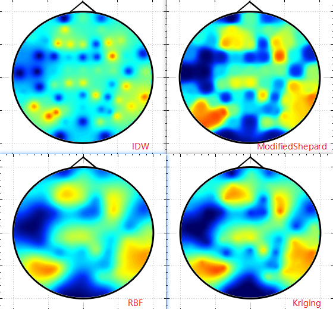

# SimpleMultivariateInterpolation
SimpleMultivariateInterpolation is a simple interpolation project providing IDW, ModifiedShepard, RadialBasisFunction, Kriging, which are introduced in [MultivariateInterpolation](https://en.wikipedia.org/wiki/Multivariate_interpolation)

# Dependencies
SimpleMultivariateInterpolation uses the following libraries
* [Qt](https://www.qt.io/)
* [QCustomplot](https://www.qcustomplot.com/)
* [Eigen](https://eigen.tuxfamily.org/index.php?title=Main_Page)
* [Boost-polygon](http://boost.org), I wish to use it's voronoi to write  Natural Neighbor Interpolation, TODO.

# Example
* interpolation. A visualization of the interpolation methods using [ColorMap](https://github.com/miyanyan/QColorMapDemo) 

* voronoi. A visualization of voronoi, which will be used by Natural Neighbor Interpolation.
